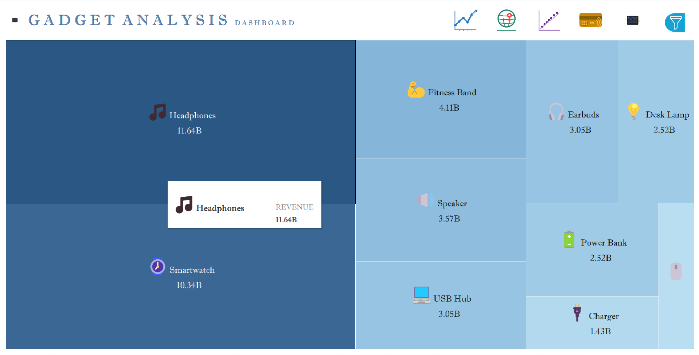
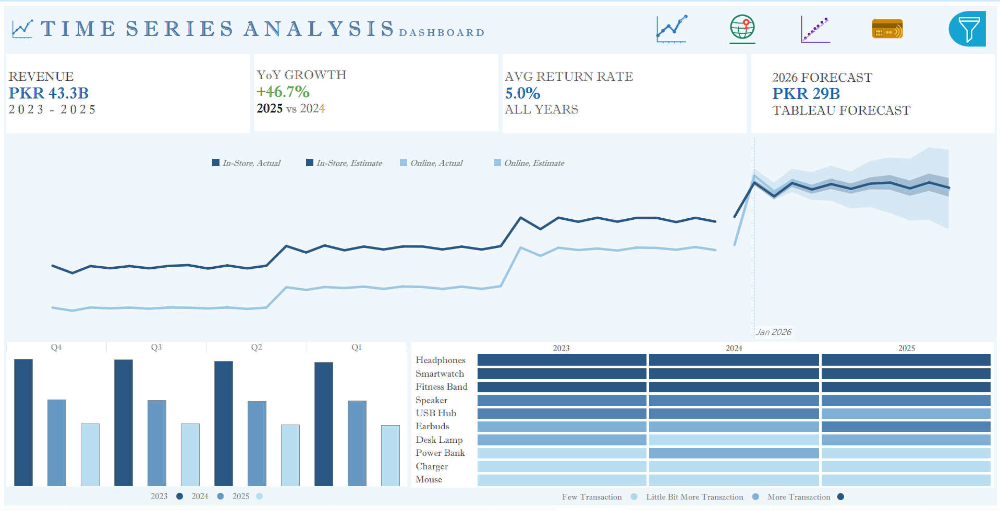
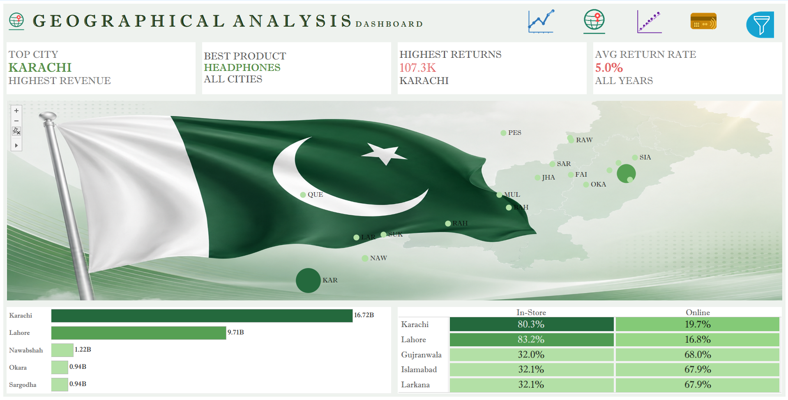
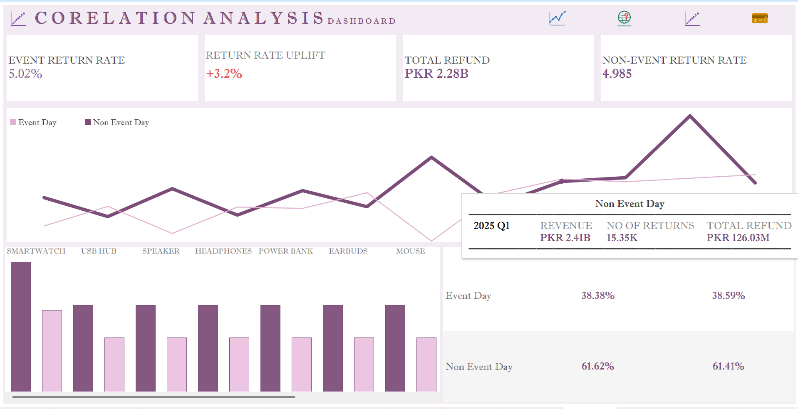
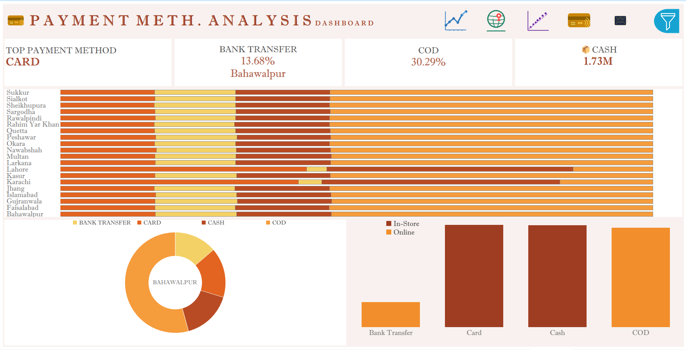

# Manju Bhai e-Gadgets — Sales Analysis (2023–2025)

> **End-to-end data analytics project** covering SQL data engineering (Medallion Architecture) and interactive Tableau dashboards, built as a portfolio piece by **Dennis Acquah**.

---

## Project Overview

This project analyses three years of synthetic e-commerce sales data for **Manju Bhai e-Gadgets**, a consumer electronics retailer operating across 20 cities in Pakistan. The pipeline moves raw transactional data from ingestion through cleaning and aggregation into business-ready Gold tables, which power five interactive Tableau dashboards.

**Purpose:** Portfolio project to demonstrate end-to-end data analytics skills — SQL data engineering, business insight generation, and interactive dashboard design.

**Data Source:** [Manju Bhai e-Gadgets Sales — Kaggle](https://www.kaggle.com/datasets/hassanabsar/manju-bhai-gadgets-sales) *(synthetic dataset)*

---

## Key Findings

- **PKR 43.3B** total revenue generated across 2023–2025
- **+46.7% YoY growth** from 2024 to 2025 — the strongest growth period on record
- **Headphones** is the top-grossing product at PKR 11.64B, followed closely by Smartwatch at PKR 10.34B
- **Karachi** leads all cities with PKR 16.72B in revenue — more than double second-place Lahore (PKR 9.71B)
- **Card** is the most used payment method nationally; COD accounts for 30.29% of transactions
- **In-Store** dominates in Karachi and Lahore (80–83%), while Gujranwala and Islamabad are predominantly Online (68%)
- **2026 Tableau Forecast** projects PKR 29B in revenue based on historical trend
- Return rate is stable at **5.0%** across all years; event days show a marginal +3.2% uplift in return rate vs non-event days

---

## Dashboard Gallery

### 1. Gadget Analysis Dashboard
*Treemap of product revenue — see which gadgets drive the most value*



---

### 2. Time Series Analysis Dashboard
*Revenue trends by channel (In-Store vs Online), quarterly breakdown, product transaction heatmap, and 2026 Tableau forecast*



---

### 3. Geographical Analysis Dashboard
*Pakistan city map, top-city KPIs, revenue by city bar chart, and In-Store vs Online channel split per city*



---

### 4. Correlation Analysis Dashboard
*Event Day vs Non-Event Day comparison — revenue, return rates, refund exposure, and product-level breakdown*



---

### 5. Payment Method Analysis Dashboard
*Payment mix by city, top payment method KPIs, city-level donut chart, and channel vs payment method breakdown*



---

## Project Demo (Video Walkthrough)

> Full screen recording walkthroughs of the dashboards — narrated tour of all five views with live interactivity.

| Video | Description | Link |
|---|---|---|
| Dashboard Walkthrough — Full | Complete narrated tour of all 5 dashboards | [Watch on YouTube](https://youtu.be/qJMVxWdo5MQ) |
| SQL Pipeline Walkthrough | ETL & EDA preview — Bronze to Gold layer (2× speed, 9 min) | [Watch on YouTube](https://youtu.be/FIEMrfG4fLM) |

> **To update:** Upload your `.mp4` files to YouTube (set visibility to **Unlisted** so only people with the link can view), then replace `YOUR_VIDEO_ID_HERE` with the actual video IDs from the YouTube URLs.

---

## Architecture

```
CSV Files  (Kaggle)
      │
      ▼
┌──────────────────────────────────────────────┐
│  BRONZE LAYER  —  Raw Ingestion              │
│  bronze.sales_raw       (5,576,637 rows)     │
│  bronze.sku_details_raw (20 rows)            │
│  All columns NVARCHAR. Audit metadata added. │
│  NEVER update or delete.                     │
└──────────────────────┬───────────────────────┘
                       │  EXEC bronze.load_bronze
                       ▼
┌──────────────────────────────────────────────┐
│  SILVER LAYER  —  Clean & Enrich             │
│  silver.sku_details_cleaned                  │
│  silver.sales_cleaned   (5,576,637 rows)     │
│  silver.sales_enriched  (joined + revenue)   │
│  silver.anomalies       (data quality view)  │
│  Type-cast · Normalized · Validated          │
└──────────────────────┬───────────────────────┘
                       │  EXEC silver.usp_load
                       ▼
┌──────────────────────────────────────────────┐
│  GOLD LAYER  —  Business Marts               │
│  gold.daily_sales                            │
│  gold.sku_performance                        │
│  gold.city_performance                       │
│  gold.event_return_analysis                  │
│  Aggregated · Indexed · Tableau-ready        │
└──────────────────────┬───────────────────────┘
                       │  EXEC gold.usp_load
                       ▼
               Tableau Dashboards
```

---

## Project Structure

```
manju-bhai-egadgets-sales-analysis/
│
├── README.md
├── .gitignore
│
├── sql/                              # T-SQL scripts — run in order
│   ├── 01_init_database.sql          # Create database + schemas
│   ├── 02_bronze_layer.sql           # Raw ingestion layer
│   ├── 03_silver_layer.sql           # Cleaning & enrichment
│   ├── 04_gold_layer.sql             # Aggregated business marts
│   └── 05_eda_analysis.sql           # Exploratory analysis queries
│
├── data/
│   ├── sku_details.csv               # Product reference (20 rows)
│   └── gold_outputs/                 # Aggregated outputs from Gold layer
│       ├── gold.daily_sales.csv
│       ├── gold.sku_performance.csv
│       ├── gold.city_performance.csv
│       └── gold.event_return_analysis.csv
│
├── tableau/
│   └── E_Gadgets_Visualization.twbx  # Tableau packaged workbook (5 dashboards)
│
└── dashboards/                       # Dashboard screenshots
    ├── 01_gadget_analysis.png
    ├── 02_time_series.png
    ├── 03_geographical.png
    ├── 04_correlation.png
    └── 05_payment_method.png
```

> **Note:** The raw source file `manju_bhai_sales.csv` (246MB, 5.5M rows) is not included in this repo due to GitHub file size limits. Download it directly from [Kaggle](https://www.kaggle.com/datasets/hassanabsar/manju-bhai-gadgets-sales).

---

## SQL Scripts — Execution Order

> Run scripts **in sequence**. Each layer depends on the one before it.

| # | Script | Purpose |
|---|---|---|
| 1 | `01_init_database.sql` | Create database + all schemas |
| 2 | `02_bronze_layer.sql` | Bronze DDL, load procedure, indexes, QA |
| 3 | `03_silver_layer.sql` | Silver cleaning procedure + anomalies view |
| 4 | `04_gold_layer.sql` | Gold aggregation procedure |
| 5 | `05_eda_analysis.sql` | Exploratory analysis queries |

```sql
-- One-liner to refresh the full pipeline
EXEC bronze.load_bronze;
EXEC silver.usp_load;
EXEC gold.usp_load;
```

---

## Key Transformations (Silver Layer)

| Column | Raw (Bronze) | Cleaned (Silver) |
|---|---|---|
| `date` | `NVARCHAR` `"2023-04-13"` | `DATE` + 8 derived date parts |
| `channel` | `"online"` / `"instore"` | `"Online"` / `"In-Store"` |
| `payment_method` | `"bt"` / `"cod"` | `"Bank Transfer"` / `"COD"` |
| `sku_price` | `"2,499"` | `2499.00` `DECIMAL(10,2)` |
| `city` / `payment_method` (NULL) | NULL dropped | Kept as `"Unknown"` |
| `return_flag` / `event_flag` | `NVARCHAR` `"0"/"1"` | `BIT` |
| `delivery_charges` | `NVARCHAR` | `INT` |
| `product_family` | — | Derived from SKU range |
| `price_tier` | — | Budget / Mid-Range / Premium (PKR) |
| `gross_revenue` | — | `sku_price` × (1 if not returned) |
| `total_revenue` | — | `gross_revenue + delivery_charges` |
| `refund_amount` | — | `sku_price` × (1 if returned) |

---

## Gold Layer Tables

| Table | Purpose | Key Dimensions |
|---|---|---|
| `gold.daily_sales` | Time-series trends | date, channel, day_type |
| `gold.sku_performance` | Product analytics + revenue ranking | sku, product_family, price_tier |
| `gold.city_performance` | Geographic analytics | city, payment mix, channel split |
| `gold.event_return_analysis` | Event impact & return correlation | is_event_day, product_family |

---

## Anomaly Detection (Silver Layer)

Two business rule violations are flagged during cleaning:

| Anomaly | Rule |
|---|---|
| `delivery_anomaly` | In-store orders with non-zero delivery charge, or Online orders without 500 PKR delivery |
| `cod_instore_anomaly` | Cash-on-delivery payment used on an in-store transaction |

Query `silver.anomalies` to review flagged records.

---

## How to Reproduce

**Requirements:** SQL Server 2022 (Express or higher), SSMS, Tableau Desktop or Tableau Public

1. Download source data from [Kaggle](https://www.kaggle.com/datasets/hassanabsar/manju-bhai-gadgets-sales)
2. Run `sql/01_init_database.sql` through `sql/04_gold_layer.sql` in sequence
3. Load data using SSMS Import Flat File Wizard or `BULK INSERT` (see `02_bronze_layer.sql` for both methods)
4. Export Gold tables to CSV or connect Tableau directly to SQL Server
5. Open `tableau/E_Gadgets_Visualization.twbx` in Tableau Desktop / Tableau Public

---

## Tech Stack

| Tool | Purpose |
|---|---|
| SQL Server 2022 (Express) | Database engine |
| T-SQL | Data pipeline scripting |
| SSMS | Query & pipeline execution |
| Tableau Public 2025.3 | Dashboard design & visualisation |

---

## Dataset

| Property | Details |
|---|---|
| **Source** | [Kaggle — Manju Bhai e-Gadgets Sales](https://www.kaggle.com/datasets/hassanabsar/manju-bhai-gadgets-sales) |
| **Author** | Hassan Absar |
| **Period** | January 2023 – December 2025 |
| **Transactions** | 5,576,637 rows |
| **Cities** | 20 major Pakistani cities |
| **Products** | 10 product families (Headphones, Smartwatch, Fitness Band, Speaker, USB Hub, Earbuds, Desk Lamp, Power Bank, Charger, Mouse) |
| **Type** | Synthetic — created for analytics practice |

---

## About the Analyst

**Ignatus Dennis Acquah** — Data Analyst  
This project was built to sharpen and showcase skills in data engineering, SQL pipeline design, and business intelligence visualisation.

Connect on [LinkedIn](www.linkedin.com/in/adignatus) · [YouTube](UCWVYX7RKq-HnxDSDdukqnjA)· [Kaggle Dataset](https://www.kaggle.com/datasets/hassanabsar/manju-bhai-gadgets-sales)
